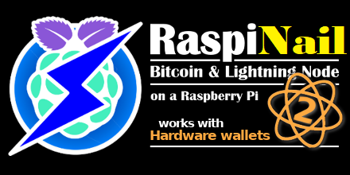

<!-- markdownlint-disable MD014 MD022 MD025 MD033 MD040 -->

**This is a forked, improved and updated version of the original work "RaspiBolt" from Stadicus, made years ago. Thank him for the great ammount of work invested in his great original guide:**
[https://stadicus.github.io/RaspiBolt/](https://stadicus.github.io/RaspiBolt/) 
  

## Beginner’s Guide to ️Bitcoin Node on a Raspberry Pi 4
{: .no_toc }

{:target="_blank"}

---

The **RaspiNail** node builds on the Raspberry Pi 4 platform.  
You can download this full guide here: [RaspiNail](https://github.com/regiregi22/RaspiNail/) 

---

## Table of contents
{: .no_toc .text-delta }

1. TOC
{:toc}

---

## About this guide

### Structure

1. Introduction (this page)
1. [Preparations](raspibolt_10_preparations.md): get all required parts
1. [Raspberry Pi](raspibolt_20_pi.md): set up and configure the Pi as a Linux server
1. [Security](raspibolt_21_security.md): secure and harden your installation
1. [Privacy](raspibolt_22_privacy.md): configure Tor networking for improved privacy
1. [Bitcoin](raspibolt_30_bitcoin.md): run Bitcoin Core as a fully validating node
1. [Lightning](raspibolt_40_lnd.md): spin up the Lightning Network Daemon (LND)
1. [Electrum](raspibolt_50_electrs.md): use your node with Hardware Wallets
1. [Bonus Section](raspibolt_60_bonus.md): go beyond with optional topics
1. [Troubleshooting](raspibolt_70_troubleshooting.md): debug your system if you have problems
1. [FAQ](raspibolt_faq.md): frequently asked questions and further reading

### Purpose

My aim is to set up a Bitcoin and Lightning node that

* is a Bitcoin Full Node running 24/7, supporting Lightning Network routing, and not requiring any trust in a 3rd party.
* is configured with the higher standards of security and privacy, while keeping usability and compatibility.
* is set up with Ubuntu Server 64bit, [the far most widely used server OS](https://w3techs.com/technologies/details/os-linux).
* has overdimensioned hardware specs that will last for years.
* is set up without graphical user interface and is used remotely using the Secure Shell (SSH) command line.

### Target audience

This guide strives to give simple and foolproof instructions.
But the goal is also to do everything ourselves, no shortcuts that involve trust in a 3rd party allowed.
This makes this guide quite technical and lengthy, but I try to make it as straightforward as possible and explain everything for you to gain a basic understanding of the how and why. If you like to learn about Linux, Bitcoin and Lightning, this guide is for you.

## A word of caution
All components of the Lightning network are still under development and we are dealing with real money here.
Unfortunately, nobody uses the Lightning Testnet, so we will go straight for Mainnet.
But please be aware that you should start with small amounts that you are willing to lose.

## Community Support
Find help and other RaspiNail users on the following platforms:
* [Github Issues / Knowledge Base](https://github.com/regiregi22/RaspiNail/issues)

---

Get started: [Preparations >>](raspibolt_10_preparations.md)
